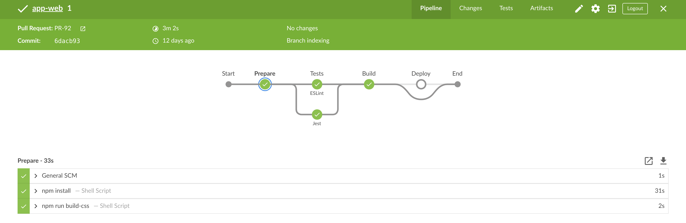
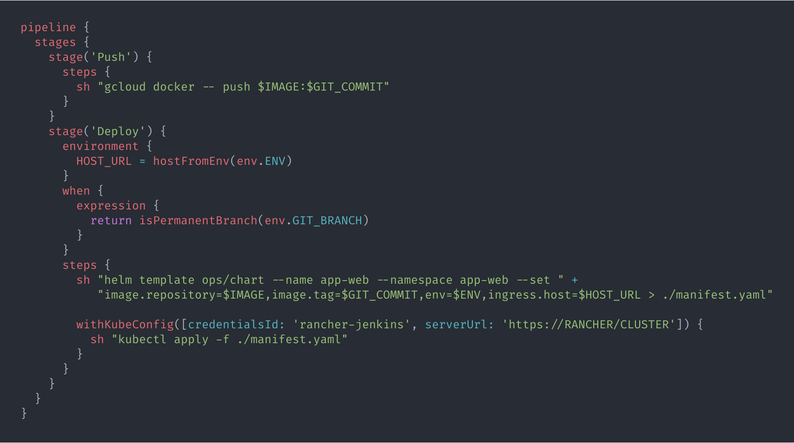

# CI/CD @ TrackCode

### Using Jenkins, Helm & Kubernetes

---

### Content

- About me
- Definition of CI/CD
- Existing Stack
- Implementation
- Pros & Cons
- Whats next?

---

### About me


Julian Tölle  
Developer @ <span style="color: #e74c3c">narando</span> & <span style="color: #f2f2f2">TrackCode</span>  
Backend Development & DevOps

--

### About us

 <!-- .element style="background-color: #ffffff" -->

- ~ 5 Employees
- Last-mile scanning solution for logistics
- Nodejs + React

---

### Definition of CI/CD

#### Continuous Integration

> Continuous Integration (CI) is a development practice that requires
> developers to integrate code into a shared repository several times a day.
>
> Each check-in is then verified by an automated build, allowing teams to
> detect problems early.

<small>From [ThoughWorks](thoughtworks.com/continuous-integration)</small>

--

### Definition of CI/CD

#### Continuous Delivery

> Continuous Delivery (CD) is a software development discipline where you build
> software in such a way that the software can be released to production at any
> time.

<small>From [Martin Fowler](https://martinfowler.com/bliki/ContinuousDelivery.html)</small>

--

### Definition of CI/CD

#### Summary

- Merge often
- Test everything
- Deploy quickly

---

### Existing Stack

- Bitbucket Server
- Jenkins
- Dedicated machines for each service

--

### Existing Stack

#### Jenkins

- Seperate jobs per service instance and environment
- Polling for SCM changes
- Freestyle jobs executing shell:

```bash
rsync -avz . jenkins@SERVICE-MACHINE:/var/www/
ssh jenkins@SERVICE-MACHINE "./deploy.sh production"
```

--

### Existing Stacks

#### Pain Points

- Configuration only in Jenkins
- No hermetic builds
- Deploying means capacity reduction
- Only application, no infrastructure

---

### Implementation

#### Premise

<table>
  <tr>
    <td>Deployment Target</td>
    <td>Kubernetes</td>
  </tr>
  <tr>
    <td>Build Tool</td>
    <td>Jenkins</td>
  </tr>
</table>

--

### Implementation

#### Workflow

1.  Make changes and commit
1.  Create PR from feature branch to `master`
1.  Automatic tests and linting provide inline feedback
1.  Code Review from peers
1.  Act upon test and review feedback
1.  Merge
1.  Deployment is triggered

---

### Implementation / Build

- Triggered by Webhook
- On every push/pr
- Steps defined in `Jenkinsfile`
- Build defined in `Dockerfile`

--

### Implementation / Build

#### Jenkinsfile Build Steps

 <!-- .element height="66%" width="66%" -->

--

### Implementation / Build

#### Jenkins Blue Ocean UI



---

### Implementation / Deployment

- Defined in same `Jenkinsfile`
- Executed when `branch IN (master, dev)`

--

### Implementation / Deployment

#### Helm

- Incubating CNCF Project
- "Package Manager for Clusters"
- CLI Tool (`helm`) and in-cluster Operator (`tiller`)
- Only used for templating
- Alternatives: ksonnet, kubetpl, ...

--

### Implementation / Deployment

#### Helm Workflow

- Render Helm Chart to Kubernetes Manifest
- Apply Manifest against cluster

--

### Implementation / Deployment

#### Folder Structure

```
app-web
└── ops
    ├── chart
    │   ├── Chart.yaml
    │   ├── templates
    │   │   ├── configmap.yaml
    │   │   ├── deployment.yaml
    │   │   ├── _helpers.tpl
    │   │   ├── ingress.yaml
    │   │   └── service.yaml
    │   └── values.yaml
    └── nginx
        └── default.conf
```

--

### Implementation / Deployment

#### Jenkinsfile Deploy Steps



---

## Pros & Cons

### Pros

- Explicit, reviewed, tracked configuration
- Infrastructure also deployed
- Clean builds
- Every commit/pr is build

--

## Pros & Cons

### Cons

- Dependency on local tools
  - `kubectl`, `helm`, `docker`, `npm`, `node`
- Leftover build artifacts
- Groovy is unnecessarily verbose
- Missing clean up of orphaned k8s resources

---

### Whats next?

- Container native build tools
  - e.g. Drone.io, Jenkins X, Concourse
  - explicit tool dependencies
  - built-in docker garbage collection
- Helm v3
  - deprecation of `tiller` in favor of `CRDs`
  - still allowing clean up of orphaned resources
